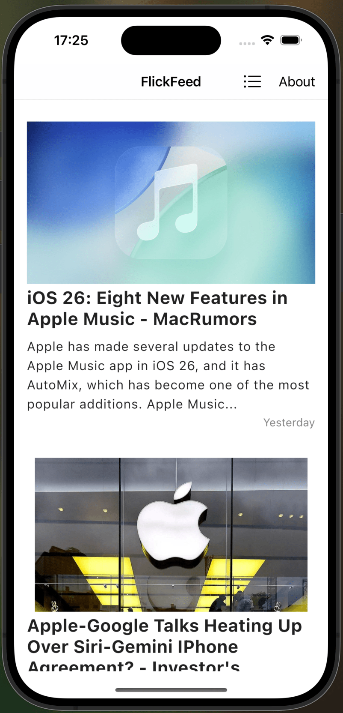
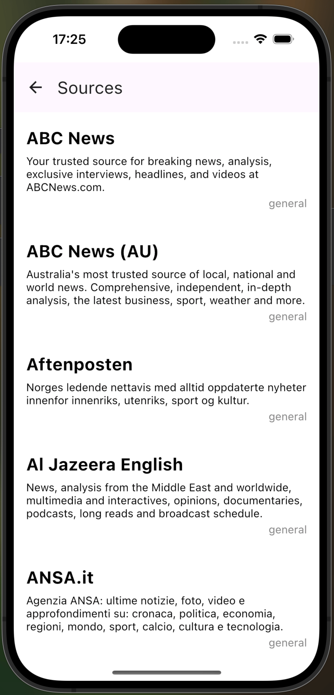

# FlickFeed

FlickFeed is a Kotlin Multiplatform MVP project designed to deliver a seamless article consumption experience across Android, iOS, and a supporting Ktor server backend. It leverages the power of Kotlin to share business logic and UI components (via Compose Multiplatform) across different platforms.

⚠️This MVP project was made to learn the new Kotlin Multiplatform framework and its limitations.

The challenge during this project was to make a cross platform mobile app only using Kotlin.




## Project Structure

This repository is organized into the following key modules:

*   **`/composeApp`**: This module houses the shared UI and presentation logic built with [Jetpack Compose for Multiplatform](https://www.jetbrains.com/lp/compose-multiplatform/).
    *   `commonMain`: Contains Kotlin code common to all target platforms (Android, iOS). This is where most of the shared UI elements and ViewModels reside.
    *   `androidMain`: Platform-specific code for the Android application, including Android-specific Composables or utilities.
    *   `iosMain`: Platform-specific code for the iOS application, enabling access to iOS-native APIs or specific UI adjustments if needed.

*   **`/iosApp`**: This is the entry point for the iOS application. It contains the necessary Xcode project setup and any SwiftUI code that might be used to complement or host the Compose Multiplatform UI.

*   **`/shared`**: This crucial module contains the core business logic, data layers, and platform-agnostic utilities shared across all targets (Android, iOS).
    *   `commonMain`: The heart of the shared logic, including data models (e.g., `Article`), repositories, use cases, and networking code.
    *   `androidMain`: Android-specific implementations for interfaces defined in `commonMain` (e.g., database driver, platform settings).
    *   `iosMain`: iOS-specific implementations for interfaces defined in `commonMain`. The objective was to find an alternative to Swift programming language to make the app cross platform.
    
## Tech Stack

*   **Kotlin Multiplatform:** For sharing code across IOS and Android.
*   **Jetpack Compose for Multiplatform:** For building the user interface.
*   **Ktor:** For the backend server.
*   **SQLDelight:** For local database storage on client platforms.
*   **Koin:** For dependency injection.

## Getting Started

### Building and Running

1.  **Clone the repository:**
    ```bash
    git clone https://github.com/GaetanKarst/FlickFeed
    cd FlickFeed
    ```
2.  **Android:**
    *   Open the project in Android Studio.
    *   Select the `composeApp` run configuration.
    *   Choose an emulator or connected device.
    *   Click "Run".
3.  **iOS:**
    *   Navigate to the `iosApp` directory.
    *   Open `iosApp.xcodeproj` (or `.xcworkspace`) in Xcode.
    *   Select a simulator or connected device.
    *   Click "Run".